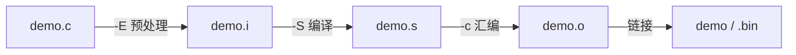

# 从一行 gcc 到看懂 .o 里的段

## 这一篇想解决什么

我们平时敲 `gcc main.c -o main`，回车，出一个能跑的程序，整个过程就像一个黑盒——只要它不报错，我们根本不想知道里面发生了什么。可一旦你开始碰嵌入式，这个"不想知道"就撑不住了：芯片上电谁先把全局变量搬进内存、`.bss` 是谁清的零、为什么有人非得写一个叫 `Reset_Handler` 的函数——这些问题全都压在"编译器到底把我的 C 代码变成了什么"这件事上。所以这一篇我们不图快，把那一行 gcc 拆开，一步一步实跑给你看，每一阶段它产出了什么、为什么长那样。

环境就两样东西，先摆出来，省得后面猜：编译用 host 上的 `gcc`（笔者这台是 `gcc (GCC) 16.1.1`），后面到第三篇讲裸机时再换成交叉工具链 `arm-none-eabi-gcc`（`14.2.0`）。一台装了 gcc 的 Linux/WSL 就能跟着做，不需要任何硬件。

## 先准备一个能体现"段"的玩具程序

为了后面能把 `.text/.data/.bss/.rodata` 都看出来，我们故意写一个每样都占一点的小程序——有初值的全局变量、没初值的全局变量、一个只读字符串、还有两段函数代码。存成 `demo.c`：

```c
#include <stdio.h>

int counter = 42;        /* 有初值的全局变量 → .data */
int zero_buf[100];       /* 初值为 0 的全局变量 → .bss */
const char *msg = "hi";  /* 只读 → .rodata */

int add(int a, int b) {  /* 代码 → .text */
    return a + b;
}

int main(void) {
    int sum = add(counter, counter);
    zero_buf[0] = sum;
    printf("%s: %d\n", msg, zero_buf[0]);
    return 0;
}
```

注释里我提前剧透了每个东西会落到哪个段，但别急着信——我们等会儿会用命令亲自验证。先别急，我们一步一步来。

## 第一步——一行 gcc 其实是四步

现在我们直接 `gcc demo.c -o demo && ./demo`，能看到 `hi: 84`（`counter` 加自己就是 84）。但这一行底下其实跑了**四个阶段**，gcc 只是把它们串起来一气呵成而已。我们用 `-E / -S / -c` 这三个开关，让它在每个阶段**停下来、把中间产物交出来**：

```bash
gcc -E demo.c -o demo.i     # ① 预处理
gcc -S demo.i -o demo.s     # ② 编译
gcc -c demo.s -o demo.o     # ③ 汇编
gcc    demo.o   -o demo     # ④ 链接
```



这四个开关名字其实有点反直觉——`-E` 是 preprocess、`-S` 是 compile to aSsembly、`-c` 是 compile（到 objeCt），别去硬记字母，记住"每一步都让 gcc 停一下、把半成品吐出来"就行。

### 预处理：`#include` 到底塞进来了什么

我们先验证第一步。`gcc -E` 只做预处理——展开 `#include`、替换 `#define`、处理条件编译，纯文本层面的事，跟机器码还没半点关系：

```bash
gcc -E demo.c -o demo.i
wc -l demo.i
```

我们原来那个 20 来行的 `demo.c`，预处理完变成了 854 行。原因很直白：`#include <stdio.h>` 把整个标准输入输出头文件原样插了进来，`demo.i` 里你现在能翻到 `printf` 的声明、各种宏、一大堆编译器内置定义。这一步的产物就是"展开后的纯 C 源码"，本质上还是人能读的文本。

### 编译：从 C 到汇编

接下来我们把这份展开后的源码编译成 **汇编**（`-S`）。注意，到这里还是人能读的——只不过从 C 变成了汇编指令：

```bash
gcc -S demo.i -o demo.s
grep -A6 '^add:' demo.s
```

跑完你能看到 `add` 函数对应的汇编，大概长这样（x86-64 上）：

```asm
add:
.LFB0:
	.cfi_startproc
	pushq	%rbp
	.cfi_def_cfa_offset 16
	.cfi_offset 6, -16
	movq	%rsp, %rbp
```

你会发现，我们写的 `int add(int a, int b){ return a+b; }` 这么短一句，到汇编里是一串压栈、移栈帧的指令——这是因为函数调用要保护现场。这一步 gcc 真正干了"翻译"的活：把 C 的语义翻成 CPU 能一条条执行的指令序列，只不过先用汇编这种人类可读的记号写出来。

### 汇编：从汇编到目标文件 `.o`

再往下，`-c` 把汇编变成**目标文件**（object file，`.o`）。这一步开始，产物就不是给人看的了——它已经是机器码：

```bash
gcc -c demo.s -o demo.o
file demo.o
```

`file` 会告诉你 `demo.o` 是个 ELF relocatable（可重定位目标文件）。这时候你还**不能直接运行它**——因为它里面的地址都还是相对的、外部符号（比如 `printf`）还没着落。这正是下一步"链接"要解决的。

### 链接：把零件拼成能跑的程序

最后一步是链接，把 `.o` 跟需要的库（这里 `printf` 在 libc 里）拼到一起，填好所有地址，吐出一个能执行的程序：

```bash
gcc demo.o -o demo
./demo
```

输出就是那句 `hi: 84`。很好，到这里我们把那一行黑盒 gcc 彻底拆穿了——它从来不是一步，是预处理、编译、汇编、链接四步的串联，只是平时它懒得跟你废话全做完而已。

## 第二步——`.o` 不是一坨，它是分段的

拆完流水线，我们现在要钻进 `.o` 里面看一件对嵌入式至关重要的事：**目标文件不是一整块机器码，它是分成好几个"段"（section）的**。最直接看法是 `size`：

```bash
size demo.o
```

实跑输出（你的数字可能略有出入，但结构一样）：

```text
   text	   data	    bss	    dec	    hex	filename
    251	     12	    400	    663	    297	demo.o
```

这里我们最关心前三列。`text` 是代码、`data` 是有初值的全局/静态变量、`bss` 是初值为 0 的全局/静态变量。回头对照我们写的 `demo.c`：`counter = 42` 进了 `data`，`zero_buf[100]`（400 字节）进了 `bss`，函数代码进了 `text`——数字对得上。

那为什么嵌入式工程师对这几个段近乎神经质地在意？因为 RAM 太小、Flash 也金贵，你必须时刻知道每个东西去了哪、占了多大。这里有个非常关键、新手很容易忽略的细节：**`bss` 在最终镜像里几乎不占 Flash 空间**——`size` 显示它 400 字节，但这 400 字节是运行时才需要的 RAM，烧进 Flash 的镜像里并不会真的存 400 个 0，只存一个"这一段有多长、起始地址在哪"的记录，启动代码负责在 RAM 里把它清零。所以"把一个大数组声明成没初值"在嵌入式里是真金白银地省 Flash，这也是为什么很多驱动代码里 `static uint8_t big_buf[1024];` 不写 `= {0}`——省的就是这口气。

如果你想看得更细，`objdump -h` 能把每个段单独列出来，连地址和大小都给：

```bash
objdump -h demo.o | grep -E '\.text|\.data|\.bss|\.rodata'
```

```text
  0 .text         00000068  ...  2**0
  1 .data         00000004  ...  2**2
  2 .bss          00000190  ...  2**5
  3 .rodata       0000000b  ...  2**0
```

`0x190` 就是十进制的 400，跟 `size` 的 `bss` 对得上；`.rodata` 的 `0xb`（11 字节）正是那个 `"hi: %d\n"` 格式串。我们现在已经能对着段名，反推出源码里每样东西的归宿了。

> ⚠️ 注意：`size` 报的 `data` 是 12 而不是你以为的 4（一个 `int counter`）。这是因为 `const char *msg` 这个指针本身需要重定位（它指向的字符串在 `.rodata`），GCC 把它放进了一个叫 `.data.rel.local` 的小段，`size` 把它一起算进 `data` 了。你不用现在就吃透重定位，只要记住"看到的数字偶尔比直觉大一点，多半是这类需要重定位的东西"就够了。

## 小结

到这里我们已经把第一块拼图拼完了：一行 gcc 是预处理→编译→汇编→链接四步，每步都能用 `-E/-S/-c` 单独停下来看产物；而 `.o` 是分段的，`text` 装代码、`data` 装有初值的全局、`bss` 装初值为零的全局（且几乎不占 Flash）、`rodata` 装只读常量。把这几件事在脑子里钉牢，后面讲链接脚本和启动代码时你才不会懵。

可以自测的几个点：能不能说清 `-E/-S/-c` 各停在哪个阶段、产物能不能直接运行；看到 `size` 的输出，能不能反推源码里哪个变量进了哪个段；为什么把大数组写成"无初值"在嵌入式里是省 Flash。

## 接下来

`.o` 拼成能跑的程序这一步——链接——其实埋着嵌入式最容易翻车的坑（`undefined reference`、链接顺序、库怎么找），这些我们在下一篇专门拆开聊，并且会真正打一个静态库出来链一遍。

> 下一篇：[链接、库与那个折磨新手的 `undefined reference`](./02-linking)
